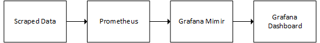

# CoT_Collect

This is a small part of the larger (non-open) project that I worked on that, with some modification, I thought may potentially prove useful to others. The idea behind the project was to monitor a number of vehicles communicating their location via Cursor-on-Target messages. The data pipeline is shown below. In addition to storing gps coordinates, the data pipeline also stored a series of radio network metrics such as signal to noise ratio (SNR) and and dropped traffic among many others. This allowed for review of network and GPS traffic when signal loss occurred to troubleshooot and improve for future tests.

Data Pipeline:

### CoT_Collect.py

When executed, this python script allows users (on Windows or Linux) to choose a network interface to montior for Cursor-on-Target (CoT) packets and presents them on an HTTP server to be scraped by Prometheus TSDB for storage.

### Prometheus.yml 

The prometheus.yml file contains the scrape configuration to ingest the gps coordinates into a prometheus TSDB. As is apparent by the contents of the file, the prometheus instance was being hosted in a Docker container with a volume on the local machine for persistent storage. 